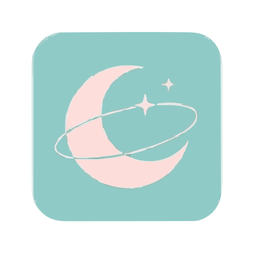

  

<h1 align="center">洛颜 LoyanBot</h1>

  <a href="README.md">English</a> |
  <a href="README_zh-CN.md">简体中文</a> |
  <a href="README_zh-TW.md">繁體中文</a> |
  <a href="README_RU.md">Русский</a> |
  <b>Français</b> |
  <a href="README_KO.md">한국어</a>

  
  
  
  
  

<!-- STATS_CARD_START -->

Source Code Stats

Python

95.9%21,924

React JSX

2.1%481

TypeScript

0.7%157

JavaScript

0.3%60

JSON

1.0%233

22,855 total · 5 languages

<!-- STATS_CARD_END -->

Un framework de chatbot multi-plateforme pour LLMs. Connectez-vous à différents modèles linguistiques de grande taille via plusieurs applications de messagerie instantanée - QQ, WeChat, Telegram, Discord, et plus encore. 😄 Extensible avec des plugins et des modules. 👍 construit sur Python 3.11+ avec un panneau web basé sur Quart-based. Convivial pour les débutants - apprenez le développement de plugin rapidement. 🎉

Nous développons LoyanBot, et il faudra encore plusieurs mois avant qu’il soit vraiment prêt pour le déploiement en production. Fonctionnalités actuellement implémentées:

<table>
<tr><th bgcolor="#8ecac8">Category</th><th bgcolor="#8ecac8">Status</th></tr>
<tr><td bgcolor="#f0fff0">Basic plugin system</td><td bgcolor="#f0fff0">✅ Done</td></tr>
<tr><td bgcolor="#f0fff0">Basic lifecycle management</td><td bgcolor="#f0fff0">✅ Done</td></tr>
<tr><td bgcolor="#f0fff0">Complete pipeline scheduling</td><td bgcolor="#f0fff0">✅ Done</td></tr>
<tr><td bgcolor="#f0fff0">Freshly developed AI brain engine</td><td bgcolor="#f0fff0">✅ Done</td></tr>
<tr><td bgcolor="#e8f4ff">Panel</td><td bgcolor="#e8f4ff">🔄 In planning</td></tr>
<tr><td bgcolor="#e8f4ff">Memory and context management</td><td bgcolor="#e8f4ff">🔄 In planning</td></tr>
<tr><td bgcolor="#f5f5f5">Complete Agent system</td><td bgcolor="#f5f5f5">⏳ Pending</td></tr>
</table>

Ce projet est migré du projet GracyBot sous la même organisation, construite sur le noyau original. La licence a été changée de MIT à GPL-3.0. Le copyright final de ce projet appartient à l’organisation MiniYv-IT2 et MiniYv.