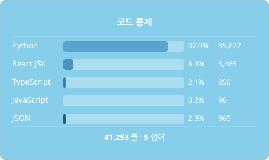

  

<h1 align="center">洛颜 LoyanBot</h1>

  <a href="README.md">English</a> |
  <a href="README_zh-CN.md">简体中文</a> |
  <a href="README_zh-TW.md">繁體中文</a> |
  <a href="README_RU.md">Русский</a> |
  <a href="README_FR.md">Français</a> |
  <a href="README_KO.md">한국어</a>

  
  
  
  
  

<!-- STATS_CARD_START -->

<!-- STATS_CARD_END -->

LLMs를 위한 멀티 플랫폼 챗봇 프레임워크입니다.QQ, WeChat, Telegram, Discord 등 여러 인스턴트 메시징 앱을 통해 다양한 대형 언어 모델에 연결하세요.😄 플러그인과 모듈로 확장 가능합니다.쿼트 기반 웹 패널로 Python 3.11+를 기반으로 제작된 👍.초보 친화-플러그인 개발을 빠르게 배웁니다.🎉

로얀봇을 개발하고 있으며, 실제 생산 배포 준비가 완료되기까지는 몇 개월이 더 걸릴 것입니다.현재 구현된 기능:

<table>
<tr><th bgcolor="#8ecac8">Category</th><th bgcolor="#8ecac8">Status</th></tr>
<tr bgcolor="#f0fff0"><td>기본 플러그인 시스템</td><td>✅ 완료</td></tr>
<tr bgcolor="#f0fff0"><td>기본 라이프사이클 관리</td><td>✅ 완료</td></tr>
<tr bgcolor="#f0fff0"><td>Pipeline</td><td>✅ 완료</td></tr>
<tr bgcolor="#f0fff0"><td>AI 엔진</td><td>✅ 완료</td></tr>
<tr bgcolor="#e8f4ff"><td>패널 (Panel)</td><td>🔄 계획 중</td></tr>
<tr bgcolor="#e8f4ff"><td>메모리 및 컨텍스트 관리</td><td>🔄 계획 중</td></tr>
<tr bgcolor="#f5f5f5"><td>Agent</td><td>⏳ 대기</td></tr>
</table>

이 프로젝트는 원래 코어를 기반으로 만들어진 같은 조직 산하의 그레이시봇 프로젝트에서 마이그레이션됩니다.라이선스가 MIT에서 GPL-3.0으로 변경되었다.본 프로젝트의 최종 저작권은 MiniYv-IT2조직 및 MiniYv에 귀속됩니다.