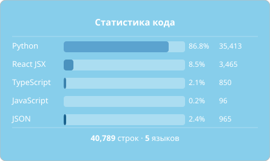

  

<h1 align="center">洛颜 LoyanBot</h1>

  <a href="README.md">English</a> |
  <a href="README_zh-CN.md">简体中文</a> |
  <a href="README_zh-TW.md">繁體中文</a> |
  <a href="README_RU.md">Русский</a> |
  <a href="README_FR.md">Français</a> |
  <a href="README_KO.md">한국어</a>

  
  
  
  
  

<!-- STATS_CARD_START -->

<!-- STATS_CARD_END -->

Многоплатформенная система чат-бота для LLMs. Подключение к различным крупным языковым моделям через несколько приложений для обмена мгновенными сообщениями — QQ, WeChat, Telegram, Discord и многое другое. 😄 Расширяется с помощью плагинов и модулей. 👍 Построен на Python 3.11+ с веб-панелью на Quart. Для начинающих — быстрое освоение разработки плагинов. 🎉

Мы разрабатываем LoyanBot, и потребуется еще несколько месяцев, прежде чем он будет действительно готов к развертыванию производства. В настоящее время реализованы следующие функции:

<table>
<tr><th bgcolor="#8ecac8">Категория</th><th bgcolor="#8ecac8">Статус</th></tr>
<tr bgcolor="#f0fff0"><td>Базовая система плагинов</td><td>✅ Готово</td></tr>
<tr bgcolor="#f0fff0"><td>Управление жизненным циклом</td><td>✅ Готово</td></tr>
<tr bgcolor="#f0fff0"><td>Pipeline</td><td>✅ Готово</td></tr>
<tr bgcolor="#f0fff0"><td>Двигатель головного мозга ИИ</td><td>✅ Готово</td></tr>
<tr bgcolor="#e8f4ff"><td>Панель (Panel)</td><td>🔄 Планируется</td></tr>
<tr bgcolor="#e8f4ff"><td>Управление памятью и контекстом</td><td>🔄 Планируется</td></tr>
<tr bgcolor="#f5f5f5"><td>Agent</td><td>⏳ Ожидается</td></tr>
</table>

Этот проект перенесён из проекта GracyBot под эгидой той же организации, основанной на первоначальном ядре. Лицензия была изменена с MIT на GPL-3.0. Авторское право на данный проект принадлежит организации MiniYv-IT2 и MiniYv.